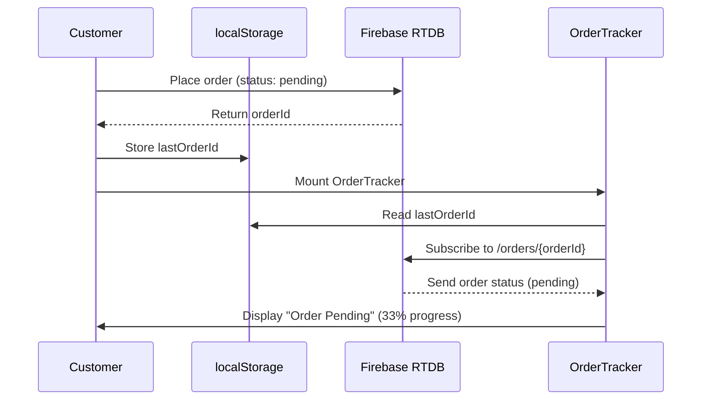
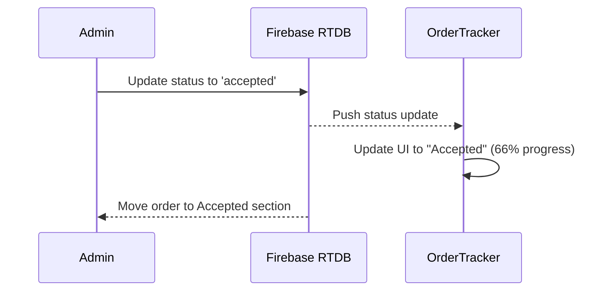
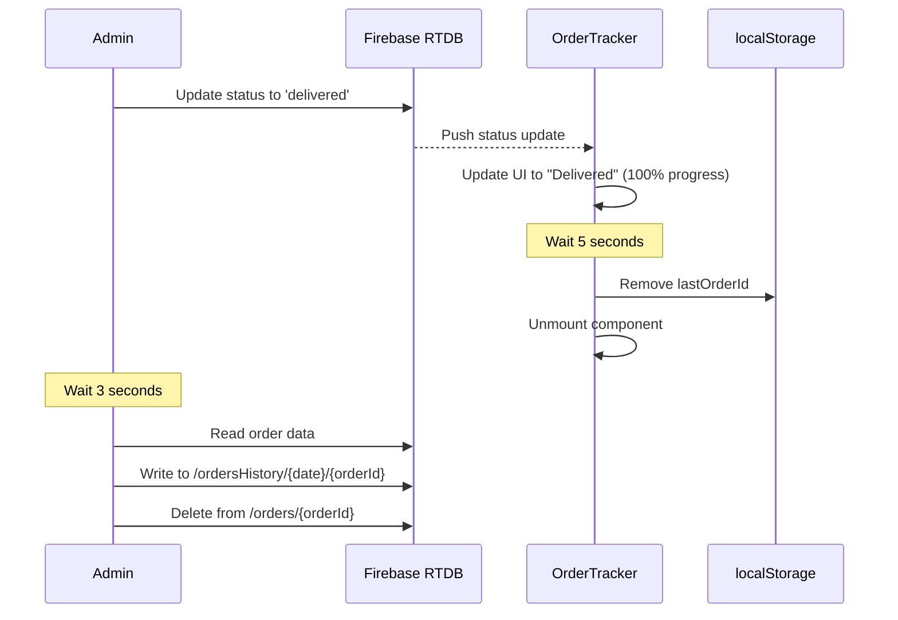

# V1 MVP Data Flow Documentation

## System Architecture

```
┌─────────────────┐         ┌──────────────────┐         ┌─────────────────┐
│  React Website  │ ◄─────► │  Firebase RTDB   │ ◄─────► │  Flutter Admin  │
│   (Customer)    │         │                  │         │      App        │
└─────────────────┘         └──────────────────┘         └─────────────────┘
         │                           │                            │
    localStorage              Real-time Sync               Authentication
```

## Detailed Flow Diagrams

### 1. Order Placement Flow



### 2. Order Acceptance Flow



### 3. Order Delivery & Archival Flow



## RTDB Data Structure

### Active Orders (/orders)
```json
{
  "orders": {
    "-NqA1B2C3D4E5F6G7H8": {
      "name": "John Doe",
      "blockDoor": "A-101",
      "mobile": "9876543210",
      "items": {
        "-itemId1": {
          "name": "Paneer Tikka",
          "price": 150,
          "qty": 2
        },
        "-itemId2": {
          "name": "Garlic Naan",
          "price": 50,
          "qty": 1
        }
      },
      "total": 350,
      "status": "pending",
      "createdAt": 1704067200000
    }
  }
}
```

### Archived Orders (/ordersHistory)
```json
{
  "ordersHistory": {
    "2024-01-15": {
      "-NqA1B2C3D4E5F6G7H8": {
        "name": "John Doe",
        "blockDoor": "A-101",
        "mobile": "9876543210",
        "items": { /* same as above */ },
        "total": 350,
        "status": "delivered",
        "createdAt": 1704067200000,
        "acceptedAt": 1704067800000,
        "deliveredAt": 1704068400000
      }
    },
    "2024-01-16": {
      "-NqB2C3D4E5F6G7H8I9": { /* another order */ }
    }
  }
}
```

### Menu Structure (/activeMenu)
```json
{
  "activeMenu": {
    "-menuItemId1": {
      "name": "Paneer Tikka",
      "price": 150,
      "meal": "lunch",
      "description": "Spiced cottage cheese cubes",
      "enabled": true,
      "category": "Starters"
    }
  }
}
```

## State Transitions

### Order Status State Machine

```
┌─────────┐
│ PENDING │ ◄── Initial state when customer places order
└────┬────┘
     │ Admin clicks "Accept"
     ▼
┌──────────┐
│ ACCEPTED │ ◄── Order acknowledged by admin
└────┬─────┘
     │ Admin clicks "Mark Delivered"
     ▼
┌───────────┐
│ DELIVERED │ ◄── Order completed
└─────┬─────┘
      │ Auto-archive after 3 seconds
      ▼
┌────────────────┐
│ ARCHIVED       │ ◄── Moved to ordersHistory
│ (in history)   │
└────────────────┘
```

### Invalid Transitions (Prevented by Code)
```
✗ pending → delivered (must go through accepted)
✗ accepted → pending (cannot go backwards)
✗ delivered → accepted (cannot go backwards)
✗ delivered → pending (cannot go backwards)
```

## Component Interactions

### Customer-Facing Components

```
App.jsx
  └─ HomePage
      ├─ Header
      ├─ MenuSection
      │   └─ ItemCard (multiple)
      ├─ Footer
      ├─ CartFloating
      ├─ CartModal
      │   └─ CheckoutModal
      │       └─ placeOrder() → stores orderId
      └─ OrderTracker ◄── NEW
          └─ Reads orderId from localStorage
          └─ Subscribes to /orders/{orderId}
```

### Admin Components

```
App.jsx
  └─ AdminPage
      ├─ AdminLogin
      └─ AdminOrders
          ├─ Pending Section
          │   └─ OrderCard (multiple)
          │       └─ "Accept" button → adminUpdateStatus()
          ├─ Accepted Section
          │   └─ OrderCard (multiple)
          │       └─ "Mark Delivered" button → adminUpdateStatus()
          └─ Delivered Section
              └─ OrderRow (multiple, compact view)
                  └─ Auto-archives after 3 seconds
```

## Function Call Map

### Customer Functions

```javascript
// 1. Add to cart
addToCart(item) → useCart.jsx
  └─ Updates localStorage 'cart'

// 2. Place order
placeOrder({ name, blockDoor, mobile, items, total }) → ordersRTDB.js
  └─ push() to /orders
  └─ Returns orderId
  └─ CheckoutModal stores in localStorage

// 3. Track order
OrderTracker component mounts
  └─ Reads localStorage 'lastOrderId'
  └─ onValue(/orders/{orderId}) → real-time updates
  └─ On delivered status → wait 5s → clear localStorage
```

### Admin Functions

```javascript
// 1. Listen to orders by status
listenOrdersPending(callback) → ordersRTDB.js
listenOrdersAccepted(callback) → ordersRTDB.js
listenOrdersDelivered(callback) → ordersRTDB.js
  └─ query(orderByChild('status'), equalTo(status))
  └─ onValue() → real-time updates

// 2. Update order status
adminUpdateStatus(orderId, newStatus) → ordersRTDB.js
  └─ update(/orders/{orderId}, { status, timestamp })
  
// 3. Archive order
archiveOrder(orderId, orderData) → ordersRTDB.js
  └─ set(/ordersHistory/{date}/{orderId}, orderData)
  └─ remove(/orders/{orderId})
```

## Security Rules Matrix

| Path | Customer Read | Customer Write | Admin Read | Admin Write |
|------|---------------|----------------|------------|-------------|
| `/orders` | ✅ Yes | ✅ Yes | ✅ Yes | ✅ Yes |
| `/ordersHistory` | ❌ No | ❌ No | ✅ Yes | ✅ Yes |
| `/activeMenu` | ✅ Yes | ❌ No | ✅ Yes | ✅ Yes |
| `/menuMaster` | ❌ No | ❌ No | ✅ Yes | ✅ Yes |
| `/shopSchedule` | ✅ Yes | ❌ No | ✅ Yes | ✅ Yes |

## localStorage Keys

| Key | Type | Purpose | Lifespan |
|-----|------|---------|----------|
| `cart` | Object | Shopping cart items | Until checkout or manual clear |
| `lastOrderId` | String | Track current order | Until delivered + 5 seconds |

## Firebase Queries & Indexes

### Required Indexes
```json
{
  "rules": {
    "orders": {
      ".indexOn": ["status", "createdAt"]
    }
  }
}
```

### Query Patterns
```javascript
// By status (indexed)
query(ref(db, 'orders'), orderByChild('status'), equalTo('pending'))

// By creation time (indexed)
query(ref(db, 'orders'), orderByChild('createdAt'), limitToLast(20))

// Single order (no index needed)
ref(db, `orders/${orderId}`)
```

## Error Handling

### Customer-Side
```javascript
try {
  const orderId = await placeOrder({...});
  localStorage.setItem('lastOrderId', orderId);
} catch (error) {
  // Show error modal
  alert('Failed to place order. Please try again.');
}
```

### Admin-Side
```javascript
try {
  await adminUpdateStatus(orderId, 'accepted');
} catch (error) {
  // Show error message
  alert(error.message || 'Failed to update order');
} finally {
  // Clear processing state
  setProcessing(prev => {
    const next = new Set(prev);
    next.delete(orderId);
    return next;
  });
}
```

## Performance Considerations

### Read Operations per Order
- Customer: 3-4 reads (status updates)
- Admin: Continuous listener (1 initial read + 2 updates)
- **Total**: ~6 reads per order

### Write Operations per Order
- Customer: 1 write (place order)
- Admin: 2 writes (status updates) + 1 write (archive) + 1 delete
- **Total**: 5 writes per order

### Optimization Techniques
1. **Flat structure**: No deep nesting (max 3 levels)
2. **Indexed queries**: All filtered queries use indexes
3. **Selective listening**: Only subscribe to needed status values
4. **Cleanup on unmount**: Unsubscribe from listeners
5. **Batched operations**: Archive + delete in same function

## Monitoring Metrics

### Key Performance Indicators
- **Order placement success rate**: Target >99%
- **Tracking accuracy**: Orders should appear in tracker within 1 second
- **Admin response time**: Status updates within 2 seconds
- **Archival reliability**: 100% of delivered orders archived

### Firebase Usage Monitoring
```bash
# Check Firebase console daily
- Simultaneous connections: < 100
- Bandwidth: < 500MB/day
- Storage: < 100MB
- Read operations: < 10,000/day
- Write operations: < 5,000/day
```

---

**Document Version**: 1.0.0  
**Last Updated**: 2024  
**Status**: Complete ✅
